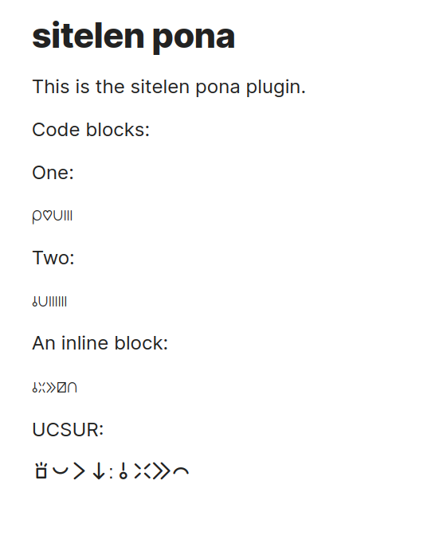

# Sitelen Pona Plugin for Obsidian

This plugin adds support for rendering Sitelen Pona (a writing system for the constructed language Toki Pona) in your Obsidian notes.

All credit to Jack Humbert for the great open source [sitelen-pona-pona](https://jackhumbert.github.io/sitelen-pona-pona/) font included here.

**Edit mode:**


**Preview mode:**



## Features

1. **Code Block Rendering**: Renders Sitelen Pona text in code blocks labeled as `sitelenpona`.
2. **Inline Rendering**: Converts text enclosed in `/.../ ` to Sitelen Pona.
3. **UCSUR Support**: Renders text enclosed in `u/.../` using the UCSUR encoding for Sitelen Pona.
4. **Customizable Fonts**: Allows users to choose their preferred fonts for both Latin-to-Sitelen conversion and UCSUR rendering.

## Usage

### Code Blocks

To render a block of text in Sitelen Pona, use the following syntax:

````
```sitelenpona
sitelen pona pona
```
````

### Inline Rendering

To convert a portion of text to Sitelen Pona, enclose it in `/.../`:

```

/mi toki e toki pona/

```

**Note**: This will only be rendered in the preview pane and not in the note editor.

### UCSUR Rendering

To render text in unicode ([UCSUR](https://github.com/Id405/sitelen-pona-ucsur-guide/blob/main/README.md)), enclose it in `u/.../`:

```

Normal text u/<unicode>/ more normal text

```

## Settings


1. **Enable Code Block Rendering**: Toggle the display of Sitelen Pona in code blocks.
2. **Enable Inline Rendering**: Toggle the display of Sitelen Pona in inline text.
3. **Latin-to-Sitelen Font**: Choose the font for converting Latin text to Sitelen Pona.
4. **UCSUR Font**: Choose the font for rendering UCSUR text.

## Installation

1. Download the zip from releases.
2. Unzip into your Obsidian vault's `.obsidian/plugins` folder.
3. Reload Obsidian.
4. Enable the plugin in Obsidian settings.

## Font Requirements

I recommend you download your favourite font(s) and enter the names in the settings.

The plugin ships with the [sitelen-pona-pona](https://jackhumbert.github.io/sitelen-pona-pona/) font for Latin to Sitelen Pona conversion and will use this if the setting is blank.

The default font for UCSUR is [nasin-nanpa](https://github.com/ETBCOR/nasin-nanpa), but that's not installed.

## Contributing

Contributions are welcome! Please feel free to submit a Pull Request or open an issue.
